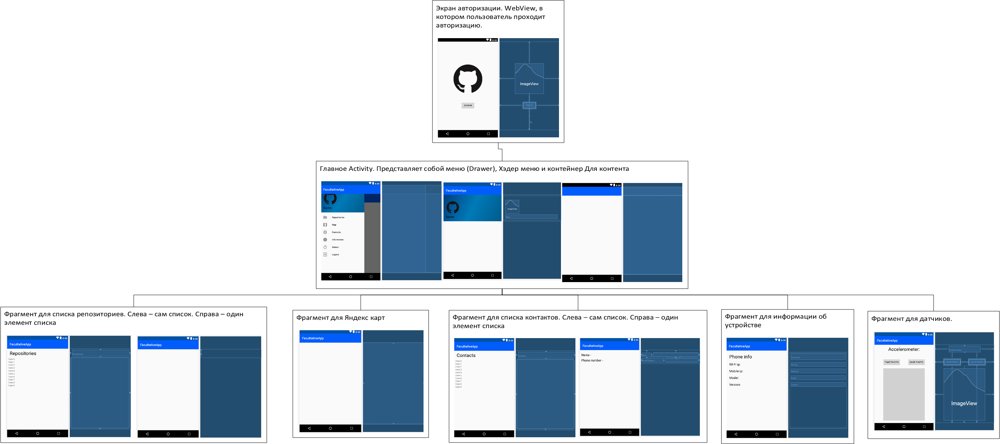

# TRMP-Facultative-App
TRMP Facultative App

# Техническое задание

## Основные требования

- Для входа в приложение использовать аутентификацю на сервере GitHub.
  Для работы с сервисом использовать GitHub API.
- Использование паттерна Navigation Drawer.
  Использовать Fragment или CustomView.
- Меню
  - Окно списка репозиториев пользователя.
  Отображение данных возможно либо с помощью WebView, либо используя RecycleView с запросами API.
  - Карты Google или Yandex.
    Отображение маршрута от дома до университета используя какой-либо вид транспорта.
  - Отображение списка контактов из телефонной книги.
  - Отображение основной информации об устройстве.
    IP, android version и т.д..
  - Отображение изменяемых значений работы одного из датчиков и получения фотографии с последующим сохранением в память.
  - Выход (logout).
  
## Задачи приложения и их описание

- Аутентификация на серевере GitHub.
  Для входа в приложение необходимо, чтобы пользователь зашел в свою учетную запись на GitHub.
- Отображение списка репозиториев пользователя.
  Реализована функция загрузки списка репозиториев пользователя и функция отображения данного списка в соответствующем окне приложения.
- Отображение маршрута от дома до университета.
  Весь маршрут разбивается на участки, соответствующие различным типам транспорта. 
  - Черная часть - пешком.
  - Зеленая часть - автобус (наземный общественный транспорт).
  - Цвета, соответствующие цветам веток метро - метро.
- Отображение списка контактов.
  Приложение запрашивает разрешение на получение подобной информации.
  Если разрешение получено, то осуществляется вывод списка контактов.
  Каждый контакт выводится парой *Имя контакта - телефон контакта*
- Информация об устройстве
  Выводимые поля:
  - IPv4
  - IPv6
  - Модель устройства
  - Версия ОС
- Работа с датчиками и камерой
  - Акселерометр
  - Взятие скриншота и сохранение его в галерею
- Выход из приложения.
  Преподполагается сброс аутентификации на GitHub
  
## Графический макет с логическими переходами

## Описание используемых API

[GitHub API](https://developer.github.com/v3/).
Было использовано 3 метода:
- Получение access token
- Получение списка репозиториев пользователя
- Получение авторизованного пользователя

[Yandex Maps](https://github.com/yandex/mapkit-android-demo/tree/master/src/main/java/com/yandex/mapkitdemo)
Благодаря данному API была реализована функция отображения маршрута от дома до университета.

[Retrofit](https://square.github.io/retrofit/)
Данная библиотека позволяет легко создавать HTTP-клиент для работы с сетью (осуществлять GET, POST запросы и т.д.)
Также была применена библиотека для автоматического распарсивания ответов с сервера в GSON.

## Описание используемого шаблона

В данном приложении сложно выделить какой-либо конкретный шаблон проектирования. В большинстве классов присутствуют признаки и модели, и представления, и презентера. Например, все фрагменты можно отнести и ко представлению, и к презентеру. Однако больше всего это напоминает MVP, так как есть классы, которые можно точно отнести к какому-либо уровню.

### Описание шаблона MVP

MVP( Model - View - Presenter) - шаблон проектирования пользовательского интерфейса, который реализует отделение бизнес логики (Model) приложения от уровня отображения. Model хранит в себе всю бизнес-логику, при необходимости получает данные из хранилища. View реализует отображение данных из Model, обращается к Presenter за обновлениями. Presenter, в свою очередь, реализует взаимодействие между Model и View. 

## Взаимодействие UI со слоем бизнес-логики

При запуске приложения неавторизованный пользователь попадает на экран авторизации.
При нажатии на кнопку "Sign in" происходит перенаправление пользователя на страницу авторизации.

    public void clickSignIn (View view) {
        signIn();
    }

    private void signIn() {
        String myUrlGit = "https://github.com/login/oauth/authorize?client_id=" + App.getCliendId() +
                "&scope=repo&redirect_uri=" + App.getRedirectUri();
        Intent intent = new Intent(Intent.ACTION_VIEW, Uri.parse(myUrlGit));
        startActivity(intent);
    }
